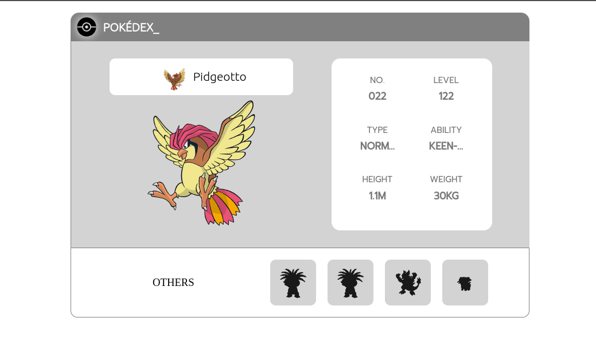

# Pokedex\_

Simple web app to fetch random pokemons

## Demo

https://pokedex-pr.netlify.app/

## Screenshots



## Tech Stack

**Client:** Html, Css, BEM, Javascript Vanilla

## Run Locally

Clone the project

```bash
  git clone https://gitlab.com/Deyvis17GY/podedex.git
```

Go to the project directory

```bash
  cd pokedex
```

Note: run locally with live server the index.html
